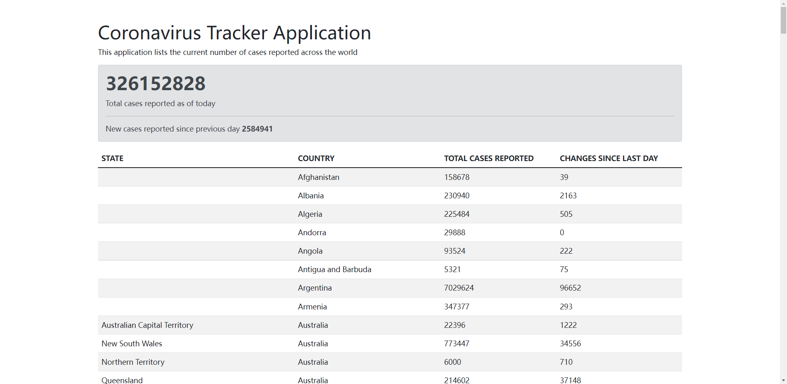

>**技术使用：**
>
>* springboot
>* thymeleaf
>* bootstrap
>
>**时      长：** 1h
>
>**教程地址：** https://www.youtube.com/watch?v=8hjNG9GZGnQ

该应用主要用于追踪最新的新冠确诊数据。相比于b站上的项目视频都从数据库获取数据，这个项目从别的地方得到数据，相对新颖（用处大不大不太清楚:joy: ）。但个人感觉对深入学习使用 SpringBoot 框架用处不大。可以学会简单使用前端的这些小工具。（但作为一名后端攻城狮... dddd :>）

> **实现效果**

